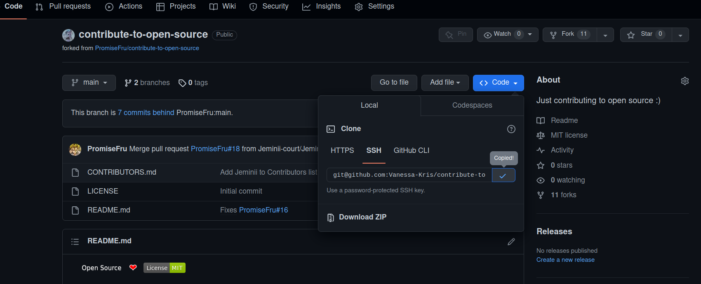
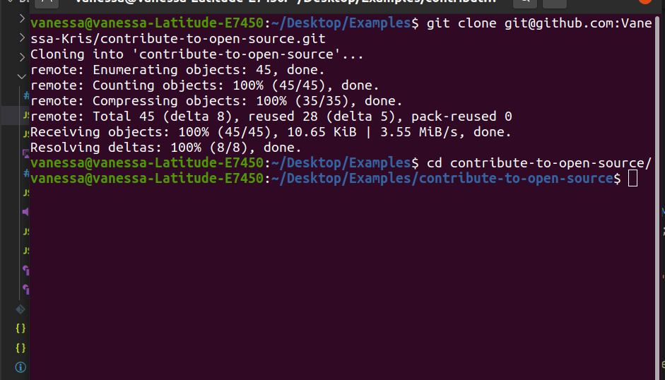

[](https://github.com/ellerbrock/open-source-badges/)
[](https://opensource.org/licenses/MIT)

# Instructions

This project is to help individuals familiarize themselves with version control Git/Github basic operations. Please follow the instructions in order and reach out for help if you can't find a way forward.

If you don't have git on your machine, [install it](https://help.github.com/articles/set-up-git/).

## Fork this repository


This will create a copy of this repository in your account.

## Clone the repository

Now clone the forked repository to your machine. Go to your GitHub account, open the forked repository, click on the code button and then click the _copy to clipboard_ icon.



Open a terminal and run the following git command:

```
git clone "url you just copied"
```



where "url you just copied" (without the quote marks) is the url to this repository (your fork of this project). See the previous steps to obtain the url.

## Create a branch

Change to the repository directory on your computer (if you are not already there):

```
cd contribute-to-open-source
```

Now create a branch using the `git checkout` command:

```
git checkout -b <your-name>
```

Replace `<your-name>` with your-name. Don't include the angle brackets (<>).

## Make necessary changes and commit those changes

Now open `CONTRIBUTORS.md` file in a text editor, add your-name to it. Now, save the file.

If you go to the project directory and execute the command `git status`, you'll see there are changes.

Add those changes to the branch you just created using the `git add` command:

```
git add CONTRIBUTORS.md
```

This adds only the changes made to the CONTRIBUTORS.md file.

Now commit those changes using the `git commit` command:

```
git commit -m "Add <your-name> to Contributors list"
```

replacing `<your-name>` with your-name.

## Push changes to GitHub

Push your changes using the command `git push`:

```
git push origin <add-your-branch-name>
```

replacing `<add-your-branch-name>` with the name of the branch you created earlier.

## Submit your changes for review

If you go to your repository on GitHub, you'll see a `Compare & pull request` button. Click on that button.

Now submit the pull request.

Soon I'll be merging all your changes into the master branch of this project. You will get a notification email once the changes have been merged.

## Congrats!

You just completed the standard _fork -> clone -> edit -> PR_ workflow that you'll encounter often as a contributor!
